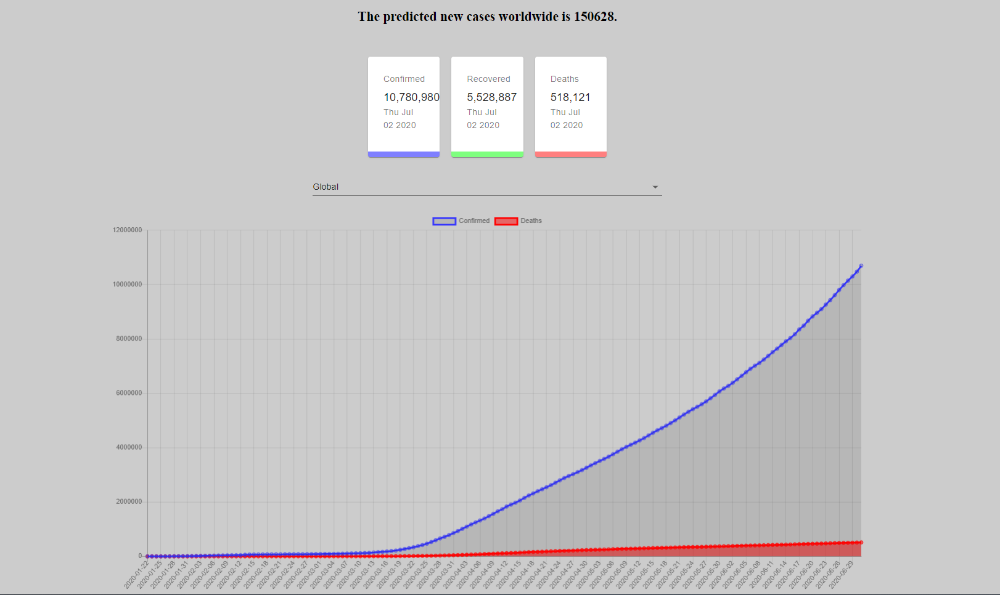

# Covid-19-predictor
Covid-19 is a web page that shows the real time covid-19 cases both globally and for all countries that have covid-19 cases.
It also ultilizes with python basic machine learning algorithms to predict the number of new cases for the next day.

Since the web page is not hosted(need some improvements for linking the prediction data to the webpage), here are some pictures to show how it looks like



API used: https://covid19.mathdro.id/api

Setup:
- run ```npm i && npm start```
